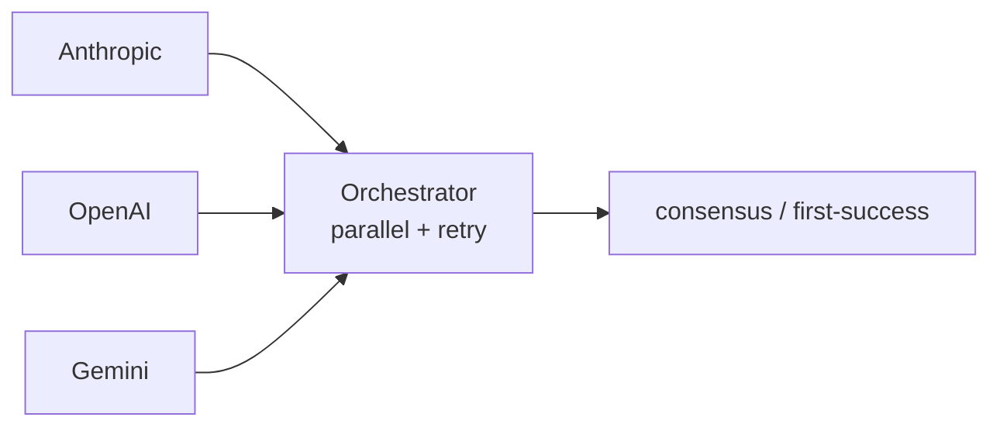
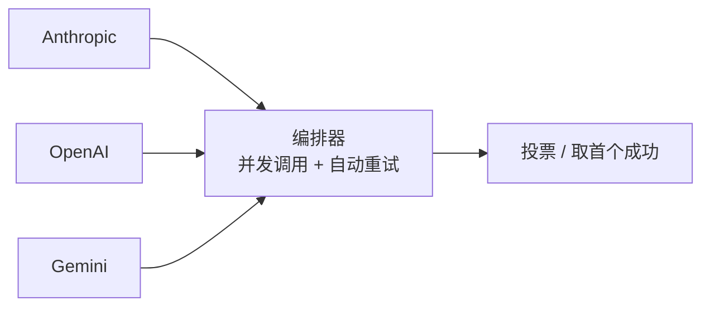

# llm-multimodel-orchestrator

[](https://www.python.org)
[](LICENSE)
[](https://github.com/astral-sh/ruff)

> **Fan out one prompt to N LLM providers in parallel. Retry per-provider. Vote on the answer.**

Built for production environments where **a single LLM is not enough** — high-stakes classification, multi-model cross-validation, or anywhere a wrong answer is expensive.

### Why I wrote this

Extracted from a multi-model decision pipeline I run in production. The retry rules and consensus voting were shaped by what actually broke in real traffic.

[English](#english) · [中文](#中文)

---

## English

### Why

Single-LLM reliability hits a wall in production:

- **Hallucinations** — confident, plausible-looking answers that are wrong.
- **Provider outages** — upstream errors propagate downstream.
- **Vendor lock-in** — switching costs are real.

This library treats LLM providers as a **redundant array** rather than a single point of failure:



### Features

- **Parallel execution** via `asyncio.gather` — total latency ≈ slowest single provider, not their sum.
- **Per-provider retries** — successful providers don't get hit twice; failures retry with linear backoff.
- **Smart error classification** — transient (timeout, 5xx, 408, 429, connection reset) retries; permanent (4xx auth/validation) fails fast.
- **Provider-agnostic** — built-in adapters for Anthropic, OpenAI, Gemini. Add your own in 20 lines.
- **OpenAI-protocol compatible** — works with any OpenAI Chat Completions-compatible gateway (self-hosted proxies, cloud aggregators, in-house routers).
- **Pluggable consensus** — majority vote, first-success, or roll your own.
- **Multimodal** — image input via base64 or URL (where the provider supports it).
- **Zero vendor SDKs** — pure `httpx`. No `openai` / `anthropic` packages required.

### Install

```bash
pip install llm-multimodel-orchestrator
```

Or directly from source:

```bash
git clone https://github.com/huangheng-dev/llm-multimodel-orchestrator
cd llm-multimodel-orchestrator
pip install -e .
```

### Quickstart

```python
import asyncio
import os

from llm_orchestrator import (
    AnthropicProvider, OpenAIProvider, GeminiProvider,
    Orchestrator,
)

async def main():
    orch = Orchestrator(providers=[
        AnthropicProvider(api_key=os.environ["ANTHROPIC_API_KEY"], model="claude-sonnet-4-6"),
        OpenAIProvider(api_key=os.environ["OPENAI_API_KEY"],       model="gpt-4o"),
        GeminiProvider(api_key=os.environ["GEMINI_API_KEY"],       model="gemini-1.5-pro"),
    ])

    result = await orch.run("Explain quantum entanglement in one sentence.")

    for name, r in result.results.items():
        print(f"{name} ({r.elapsed_ms}ms): {r.content if r.ok else r.error}")

asyncio.run(main())
```

### Majority-vote consensus

```python
import re
from llm_orchestrator import MajorityVote, Orchestrator

def extract_label(text: str) -> str:
    m = re.search(r"\b(YES|NO|MAYBE)\b", text.upper())
    return m.group(1) if m else "UNKNOWN"

orch = Orchestrator(
    providers=[...],
    consensus=MajorityVote(normalize=extract_label, min_votes=2),
)

result = await orch.run("Is water wet? Answer YES, NO, or MAYBE.")

if result.consensus:
    print(f"Consensus: {result.consensus['answer']}")
    print(f"Votes: {result.consensus['votes']}/{result.consensus['total']}")
else:
    print("Providers disagreed — no consensus.")
```

### Custom provider (any HTTP API)

```python
from llm_orchestrator import Provider, RequestPayload

class OllamaProvider(Provider):
    name = "ollama"

    def build_payload(self, prompt, images):
        return RequestPayload(
            url="http://localhost:11434/api/chat",
            json_body={"model": self.model, "messages": [{"role": "user", "content": prompt}], "stream": False},
        )

    def parse_response(self, body):
        return body["message"]["content"]
```

See [`examples/`](examples/) for full runnable scripts.

### Multimodal (image input)

```python
from llm_orchestrator import Image

with open("chart.png", "rb") as f:
    import base64
    b64 = base64.b64encode(f.read()).decode()

result = await orch.run(
    "What pattern do you see in this chart?",
    images=[Image(base64=b64, mime="image/png")],
)
```

### API reference

| Class | Purpose |
|---|---|
| `Orchestrator(providers, max_retries, retry_backoff_ms, consensus)` | Main entry point |
| `Provider` | Abstract base — subclass to add a new vendor |
| `AnthropicProvider` / `OpenAIProvider` / `GeminiProvider` | Built-in adapters |
| `MajorityVote(normalize, min_votes)` | Vote across normalized answers |
| `FirstSuccess()` | Return the first successful response |
| `OrchestrationResult` | Aggregated outcome: `.results`, `.consensus`, `.stats`, `.ok` |
| `ProviderResult` | Per-provider outcome: `.content`, `.error`, `.attempts`, `.elapsed_ms` |

### Configuration knobs

```python
Orchestrator(
    providers=[...],
    max_retries=3,           # extra attempts beyond the first
    retry_backoff_ms=500,    # linear: 500ms, 1000ms, 1500ms...
    consensus=None,          # or MajorityVote(...) / FirstSuccess()
    client=None,             # bring your own httpx.AsyncClient (for connection pooling)
)
```

### When to use this

- You're calling multiple LLMs against the same prompt for cross-validation.
- You need a vendor-agnostic gateway with retry + failover.
- You care more about *something works* than *the cheapest model*.

> **Focus**: parallel calls, smart retry, consensus voting. Anything else (streaming, complex routing) can be layered on top.

### Development

```bash
pip install -e ".[dev]"
pytest
```

### License

MIT © [Huang Heng](https://huangheng.dev)

---

## 中文

### 写它的初衷

这套并发 + 重试 + 投票的逻辑，自己生产环境里跑过。新项目又用得上，抽干净后扔出来。

### 为什么需要这个

生产环境里只调一家 LLM 通常不够稳：

- **幻觉**：模型在不熟的场景下会自信地给出错误答案
- **可用性**：上游厂商故障会传导到你的服务
- **绑定风险**：业务跟一家深度绑定，将来想换模型成本不小

这个库把多个 LLM 当作冗余通道：并发调用、按家独立重试，结果可以交叉验证或投票取共识。其中一家失败时其他家照常返回，不影响整体可用性。



### 能做什么

- **并发调用**：基于 `asyncio.gather`，总耗时约等于最慢的那家，不是几家相加
- **按厂商独立重试**：成功的不重复调用，失败的线性退避重试（最多三次）
- **错误智能分类**：网络超时、5xx、429 等瞬时错误才重试；4xx 鉴权 / 校验错误立即放弃，不浪费配额
- **厂商无关**：内置 Anthropic / OpenAI / Gemini 三家，接入新厂商只需实现两个方法（约 20 行）
- **OpenAI 协议兼容**：可对接任何兼容 Chat Completions 协议的网关
- **可插拔共识**：内置多数投票和首个成功两种策略，支持自定义
- **多模态**：图片支持 base64 或 URL（取决于厂商支持哪种）
- **不依赖厂商 SDK**：只依赖 `httpx`，不需要安装 `openai` / `anthropic` 等包

### 安装

```bash
pip install llm-multimodel-orchestrator
```

### 5 行跑通

```python
import asyncio
from llm_orchestrator import OpenAIProvider, AnthropicProvider, Orchestrator

orch = Orchestrator(providers=[
    OpenAIProvider(api_key="sk-...", model="gpt-4o"),
    AnthropicProvider(api_key="sk-ant-...", model="claude-sonnet-4-6"),
])

result = asyncio.run(orch.run("一句话解释什么是量子纠缠"))
for name, r in result.results.items():
    print(f"{name}: {r.content}")
```

### 共识投票

适合宁可不回答也别答错的场景，比如医疗、法律、金融这种高风险判断：

```python
from llm_orchestrator import MajorityVote, Orchestrator

orch = Orchestrator(
    providers=[...],  # 至少三家
    consensus=MajorityVote(min_votes=2),
)

result = await orch.run("...")
if result.consensus:
    print(f"达成共识：{result.consensus['answer']}（{result.consensus['votes']} 家同意）")
else:
    print("模型分歧太大，没有共识")
```

### 接入新厂商

任何 HTTP API 都可接入，约 20 行代码：

```python
from llm_orchestrator import Provider, RequestPayload

class MyProvider(Provider):
    name = "myllm"

    def build_payload(self, prompt, images):
        return RequestPayload(url="https://my-api.com/chat", json_body={...})

    def parse_response(self, body):
        return body["answer"]
```

### 适用场景

- 需要多个 LLM 交叉验证答案
- 需要厂商无关的网关，自带重试和故障切换
- 高风险判断需要多个模型相互验证

专注做好三件事：并行调用、智能重试、共识投票。其他能力（流式、复杂路由）可以在这之上叠加。

### License

MIT © [黄恒](https://huangheng.dev)
